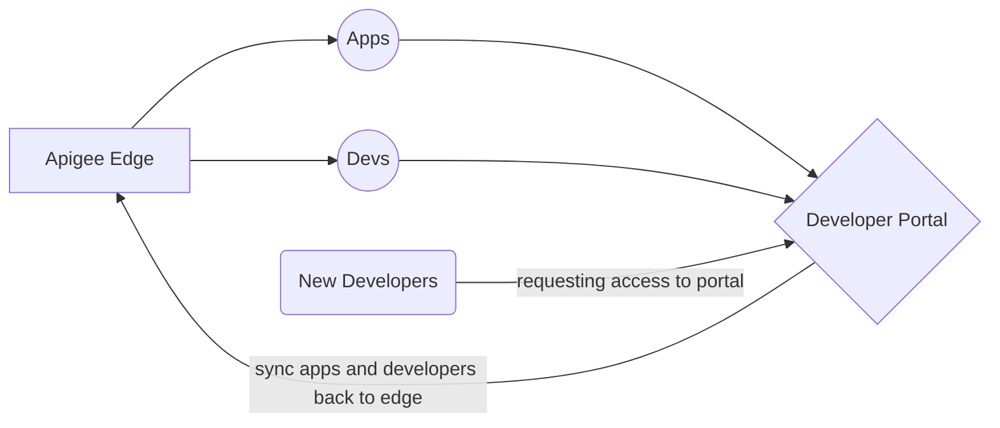

# Welcome to Stratus Meridian Developer Portal!

Developer portal V2 will give you a brand new interface with improved functionality in content editing filtering, better UI and also best in class performance.


# Installation
Use Composer to download latest source code and settings. Change *YOUR_DIRECTORY_NAME* and name it as you like for your installation root.
````
composer create-project stratus-meridian/drupal8-composer-project:8.x-dev YOUR_DIRECTORY_NAME --no-interaction
````
## Creating files and folders for your install

The package installer is supposed to create all files and folders you require. This should help in creating project's directory structure.

|                |           Location             |Can I modify These ?                         |
|----------------|-------------------------------|-----------------------------|
|**Stratus Meridian Profile files**|`'/web/profiles/contrib/sm_dev_portal'`            |Not advisable, because when you install updates, these will be overwritten.         |
|**Drupal Core Files**           |`/web/core/`            |Never touch these files. Security breaches can happen!           |
|**Custom Modules/ Themes**          |`/web/modules/custom/` and `/web/themes/custom/`|All your custom code should live here|


## Update/Upgrade to Latest version
If you are updating/upgrading your existing Stratus Meridian Developer portal to its latest version, please read the following documentation which you can find on the profile's source code under **docs** folder. 

Filename: **guides-for-updating-sm-dev-portal-to-latest-version.docx**  
Link: [guides-for-updating-sm-dev-portal-to-latest-version](https://support.stratusmeridian.com/hc/en-us/articles/360051452954-Upgrading-your-Stratus-Meridian-Developer-Portal-to-its-latest-update-)

## Running the Build Script

The theme used in this installation profile (sm_dev_portal_theme) is using [GulpJS](https://gulpjs.com/) to compile and bundle SASS and JS as well as minifying it. 
As a requirement, **Node.js** and **NPM** are needed for using the theme's build script. You need install as well **gulp** on your machine globally.

To install this, run the following code on your command interface (eg: Windows Powershell or Git Bash). 

`npm install -g gulp`

After installing Gulp, go to theme's directory (profile_name/themes/custom/theme_name) and run the following on your command interface (eg: Windows Powershell or Git Bash)

1. `gulp`


## Issues ?

Please raise an issue here on github.


## Schematic of  Developer portal connecting to Apigee Edge
The following chart shows how Apigee edge interacts with Developer portal. **Apps**, **Developers**, **developer keys and tokens** are synced from edge to dev portal. New Developers are created on portal, then synced back to edge, along with their apps and keys.


